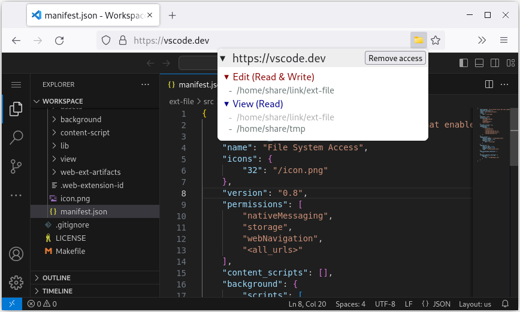

# Firefox File System Access Extension

This extension brings the [File System Access API](https://wicg.github.io/file-system-access/) to Firefox that helps web apps such as [vscode.dev](https://vscode.dev) read and write local files and folders.

## Main features

* Implemented `showOpenFilePicker()`, `showDirectoryPicker()`, `showSaveFilePicker()` and related interfaces.

* Set to enable specific File System Access features on matching web pages.

* Provides File System Access API for other compatible WebExtensions.

## Notes

* The local file operations required by this extension cannot be performed in the browser, and a [helper app](app) needs to be installed to assist in the related work.

* The optional Code Editor feature is provided by the [Code Editor](https://addons.mozilla.org/firefox/addon/code-editor/) extension.

## Limitations

* By default, `FileSystemHandle` will lose its instance methods after cloning (e.g. using `IndexedDB` or `postMessage`), and requires additional configuration of the `FS_CONFIG.CLONE_ENABLED`.
    Web developers can use `__FILE_SYSTEM_TOOLS__.parseHandle(handle)` to restore the instance methods.

* Limited Worker context support and requires additional configuration of the `FS_CONFIG.WORKER_ENABLED`.

* Read file size is limited by the `FS_CONFIG.FILE_SIZE_LIMIT`.
    Web developers can read large file streams and slices with `handle.getFile({ _allowNonNative: true })`,
    and write large file in-place with `handle.createWritable({ _inPlace: true, keepExistingData: true })`.

* `DataTransferItem.prototype.getAsFileSystemHandle` is not implemented.
